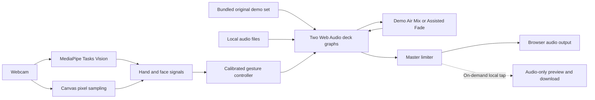

<p align="center">
  
</p>

<h1 align="center">Ultra Vision</h1>

<p align="center">
  <strong>Turn your webcam into a private DJ controller.</strong><br />
  Mix two tracks with your hand while camera frames and music stay in the browser.
</p>

<p align="center">
  <a href="https://github.com/kaantaskentt/ultra-vision/actions/workflows/ci.yml"></a>
  <a href="./LICENSE"></a>
  
</p>

<p align="center">
  <a href="https://ultra-vision.vercel.app"><strong>Try Ultra Vision live</strong></a>
  ·
  <a href="#run-it-locally">Run locally</a>
  ·
  <a href="./CONTRIBUTING.md">Contribute</a>
</p>

<p align="center">
  <a href="https://ultra-vision.vercel.app">
    
  </a>
</p>

No account, API key, database, backend, or personal audio files are required for the first mix. Ultra Vision combines two bundled original demo tracks, a two-deck Web Audio mixer, and deliberate hand control in one browser tab.

## Try your first mix in 60 seconds

1. Open the [live app](https://ultra-vision.vercel.app) and choose **DJ Room**.
2. Allow the private on-device camera, or choose **Use demo instead** for camera-off mode.
3. Add your own Deck A and optional Deck B, or select **Try demo tracks**.
4. Press **Start performance**. The first loaded deck starts; when both are present, Deck A leads and Deck B is prepared silently for a later transition.
5. Your physical left hand owns Deck A and your physical right hand owns Deck B. Point and hold over CUE, PLAY, VOLUME, or FILTER; open your palm to move the selected sound control.
6. With two decks loaded, choose **Demo Air Mix** for the bundled set or **Assisted Fade** for uploaded music. Use **Record** to capture, preview, and download the audio-only master mix locally.

Close your hand to lock volume; Filter instead returns to its neutral midpoint after release. A newly detected hand grabs the current value without moving it, then responds only to intentional movement. Pointing and continuous open-palm control are kept separate so aiming at a button cannot accidentally change the sound.

## What it can do

- **Instant demo set** — load two bundled, original, sample-free tracks without finding audio files or generating music at runtime.
- **Focused two-deck instrument** — use independent CUE and PLAY controls plus one selected VOLUME or FILTER control per deck.
- **Decoded beat workspace** — see full-track cyan/violet waveform bars, playheads, and explicitly estimated beat and bar markers directly below the camera.
- **Camera-first flow** — move through Camera, Load Tracks, and Perform while one persistent private camera stage stays mounted.
- **Independent hand ownership** — physical left controls Deck A while physical right controls Deck B. Relative pickup prevents first-frame jumps, brief landmark flicker stays latched, and filter release returns smoothly to neutral.
- **BPM tools** — estimate BPM locally, tap a correction, and use one reversible BPM Sync control to match playback rates.
- **Two honest transition modes** — the bundled demo set can begin a smooth Air Mix on its next authored bar. Uploaded tracks use an immediate Assisted Fade and apply a conservative estimated tempo match only when both local beat analyses are reliable.
- **Local audio replay** — record the post-master mix, listen to it in a local preview, then download or discard it without uploading the recording.
- **Vision workspace** — inspect hand landmarks, raised fingers, face signals, frame-change regions, and color coverage.
- **Pixel Studio** — study color similarity and luminance from an upload or captured frame with transparent, deterministic calculations.
- **Local media** — camera frames, captured images, and uploaded tracks are not sent to an application backend.

BPM Sync matches tempo; it does not claim automatic beat-grid, downbeat, or phase alignment. Demo Air Mix uses metadata authored for the two bundled tracks. Assisted Fade does not claim phrase-perfect mixing for user uploads.

## Two instruments, one private tab

| Vision | DJ Room |
| --- | --- |
|  |  |
| Start the camera to inspect live landmarks, motion, face signals, and pixel studies. | Load one or two tracks, point to a deck control, then perform with one or both hands. |

The interface reflows from desktop down to phone-sized viewports. Real camera and audio behavior still depends on the browser and device; the maintained test matrix lives in [docs/TESTING.md](./docs/TESTING.md).

## Run it locally

Use Node.js 20.19+ or 22.12+ and a recent desktop Chromium, Firefox, or Safari browser.

```bash
git clone https://github.com/kaantaskentt/ultra-vision.git
cd ultra-vision
npm ci
npm run dev
```

Open the local Vite URL. Camera access requires `localhost` or HTTPS.

## How gesture mixing feels

1. Load Deck A and optionally Deck B, then press **Start performance** to unlock browser audio.
2. Point and hold over VOLUME or FILTER for the matching deck. Left owns A; right owns B.
3. Open your palm to grab the current value without a jump. Move vertically for volume or rotate your wrist for filter.
4. Close your hand to lock volume. Filter eases back to its 50% neutral point; brief tracking flicker is ignored.
5. Point and hold over CUE or PLAY to control transport without touching the laptop.

Clicking and keyboard activation remain available for every performance target.

## Runtime architecture



The current runtime uses React 19, TypeScript, Vite, MediaPipe Tasks Vision, Canvas sampling, Web Audio, and Lucide icons. Read the deeper [architecture guide](./docs/ARCHITECTURE.md).

## Honest model and product scope

MediaPipe is the shipped vision runtime. NVIDIA Eagle / LocateAnything is **not** part of the current browser application; it remains a researched option for future open-vocabulary grounding. Its integration and model-license risks are documented in [docs/EAGLE_NEXT.md](./docs/EAGLE_NEXT.md).

The shipped recorder is intentionally audio-only. It captures the post-master mix into bounded browser memory, offers an in-tab preview and download, and itself requests no camera, microphone, screen-capture, account, or upload permission. Video capture and hosted sharing are not shipped features.

## Quality and privacy

Run the same complete local gate expected before a pull request:

```bash
npm run check
```

That command runs the test suite with coverage floors, lint, a production build with an enforced initial-JavaScript budget, and a full dependency audit at the high-severity threshold. MediaPipe is loaded only when camera tracking is requested, so a camera-off first mix does not pay its parsing cost. CI and CodeQL run on every pull request.

Camera-runtime changes also have a hardware-free production-browser contract:

```bash
npx playwright install chromium
npm run test:browser
```

It starts one production build and runs Chromium contracts for the real MediaStream and MediaPipe lifecycle, a generated open-palm pickup, mobile reflow, keyboard focus, and WCAG A/AA checks across the camera-off DJ Room, loaded demo, Vision workspace, and 390px loaded state. It does not record a contributor or claim broad physical-camera accuracy.

- Camera and uploaded media are processed in the active browser tab.
- File types and sizes are checked before object URLs are created.
- Audio replay stays in bounded browser memory while it is previewed, until it is discarded or the tab closes. Download saves a local copy; Ultra Vision does not upload or persist it.
- Lock-pinned MediaPipe WASM is served from Ultra Vision's own origin. Hand and face model bundles are fetched from their exact Google-hosted upstream URLs, accepted only after byte-length and SHA-256 verification, and then passed to MediaPipe as in-memory bytes. Camera frames are never sent with those requests.
- GPU initialization falls back to CPU when needed.
- There are no accounts, application secrets, analytics, databases, or application APIs.

See [SECURITY.md](./SECURITY.md) for responsible disclosure and [THIRD_PARTY_NOTICES.md](./THIRD_PARTY_NOTICES.md) for dependency and model notices.

## Built in public with Codex

Ultra Vision was strengthened through a human-directed Codex workflow: product feedback became explicit invariants, implementation was separated from independent review, and camera/audio behavior was backed by deterministic tests before public claims changed.

Read [Building Ultra Vision with Codex](./docs/BUILDING_WITH_CODEX.md) for the decisions, failed assumptions, agent workflow, commit evidence, and remaining limitations.

## Project status

Ultra Vision is an active experimental project. Vision, two-deck mixing, dual-hand control, bounded local audio replay, and the real-browser camera lifecycle are functional. Phrase-aware mixing for uploaded tracks, video replay and hosted sharing, a broader measured hand-gesture fixture corpus, and measured long-session performance remain future work.

Read the [roadmap](./ROADMAP.md), [testing strategy](./docs/TESTING.md), and [contributor guide](./CONTRIBUTING.md). Focused issues and pull requests are welcome.

## License

The application code is available under the [MIT License](./LICENSE). Third-party models and libraries retain their own licenses. Review the LocateAnything model license before any future integration or commercial use.
