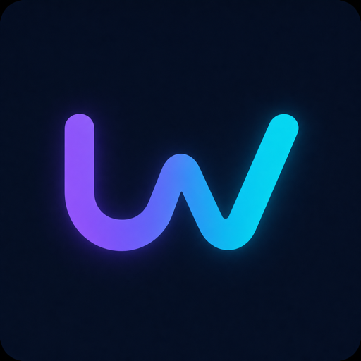
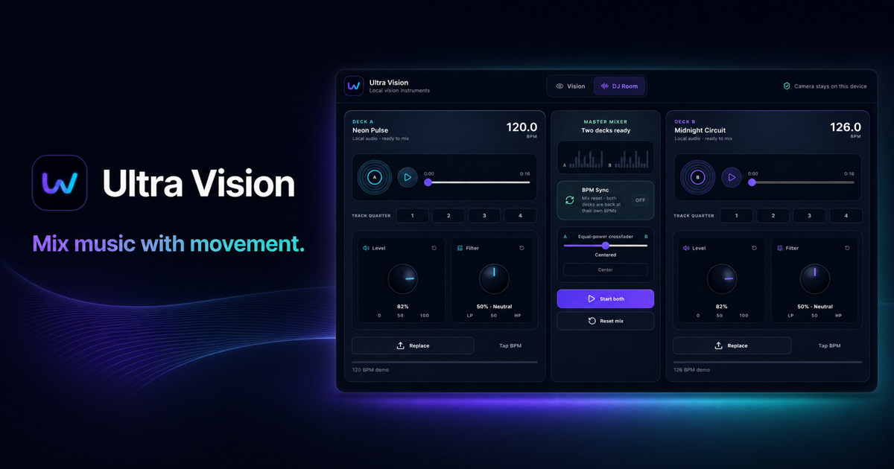
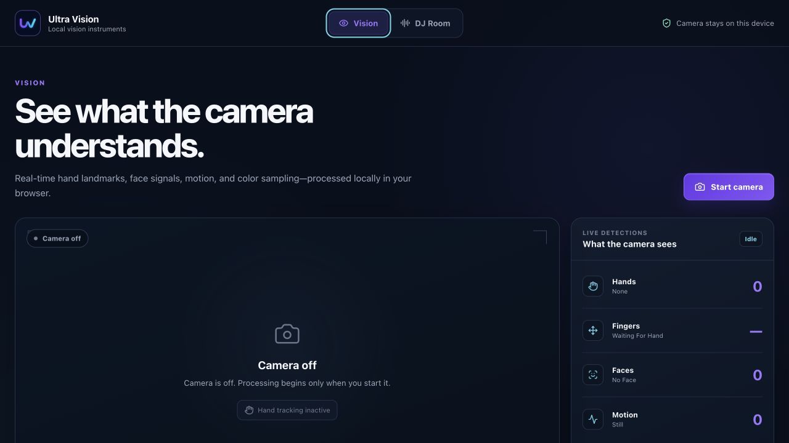
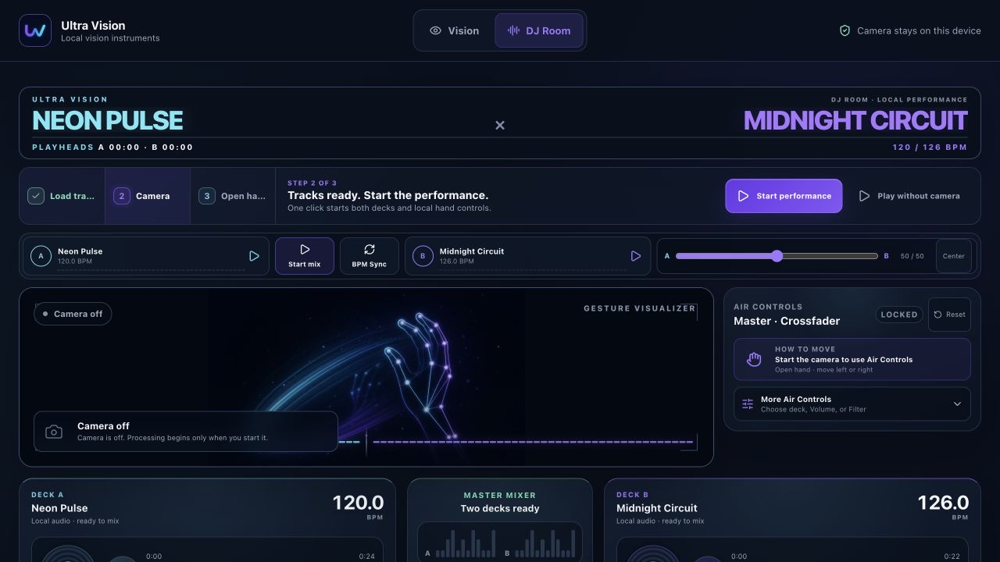
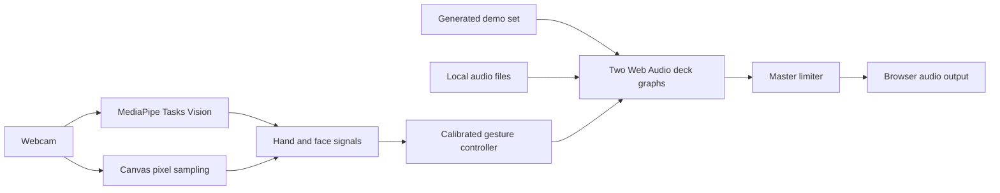

<p align="center">
  
</p>

<h1 align="center">Ultra Vision</h1>

<p align="center">
  <strong>Turn your webcam into a private DJ controller.</strong><br />
  Mix two tracks with your hand while camera frames and music stay in the browser.
</p>

<p align="center">
  <a href="https://github.com/kaantaskentt/ultra-vision/actions/workflows/ci.yml"></a>
  <a href="./LICENSE"></a>
  
</p>

<p align="center">
  <a href="https://ultra-vision.vercel.app"><strong>Try Ultra Vision live</strong></a>
  ·
  <a href="#run-it-locally">Run locally</a>
  ·
  <a href="./CONTRIBUTING.md">Contribute</a>
</p>

<p align="center">
  <a href="https://ultra-vision.vercel.app">
    
  </a>
</p>

No account, API key, database, backend, or audio files are required for the first mix. Ultra Vision combines a generated demo set, a two-deck Web Audio mixer, and deliberate hand-gesture control in one browser tab.

## Try your first mix in 60 seconds

1. Open the [live app](https://ultra-vision.vercel.app) and choose **DJ Room**.
2. Select **Load instant demo** to generate two short, copyright-safe tracks locally.
3. Press **Start performance** to start both decks and local hand tracking together—or choose **Play without camera**.
4. Raise one open palm, then use **More Air Controls** to route movement to the crossfader, a deck level, or its filter.

Close your hand to lock the crossfader or volume position; Filter instead returns to its neutral midpoint after release. A newly detected hand grabs the current value without moving it, then responds only to intentional movement.

## What it can do

- **Instant demo set** — generate two original rhythmic loops locally and reach a playable mix without finding audio files.
- **Two-deck DJ Room** — control independent transports, hardware-style level and bipolar filter knobs, live analyser signal history, track-quarter jumps, post-fader meters, a master limiter, and an equal-power crossfader.
- **First Mix cockpit** — move from a generated demo to music plus hand controls in two clear actions, with a thumb-reachable performance bar on mobile.
- **Intentional gesture routing** — send an open palm to the crossfader or one deck's level or filter. Relative pickup prevents first-frame jumps, brief landmark flicker stays latched, and a deliberate fist releases the control.
- **BPM tools** — estimate BPM locally, tap a correction, and use one reversible BPM Sync control to match playback rates.
- **Vision workspace** — inspect hand landmarks, raised fingers, face signals, motion direction, and color coverage.
- **Pixel Studio** — study color similarity and luminance from an upload or captured frame with transparent, deterministic calculations.
- **Local media** — camera frames, captured images, and uploaded tracks are not sent to an application backend.

BPM Sync matches tempo; it does not claim automatic beat-grid, downbeat, or phase alignment.

## Two instruments, one private tab

| Vision | DJ Room |
| --- | --- |
|  |  |
| Inspect live landmarks, motion, face signals, and pixel studies. | Choose one mix control, grab it with an open palm, then perform with movement. |

The interface reflows from desktop down to phone-sized viewports. Real camera and audio behavior still depends on the browser and device; the maintained test matrix lives in [docs/TESTING.md](./docs/TESTING.md).

## Run it locally

Use Node.js 20.19+ or 22.12+ and a recent desktop Chromium, Firefox, or Safari browser.

```bash
git clone https://github.com/kaantaskentt/ultra-vision.git
cd ultra-vision
npm ci
npm run dev
```

Open the local Vite URL. Camera access requires `localhost` or HTTPS.

## How gesture mixing feels

1. Pick Deck A or Deck B and choose Crossfader, Volume, or Filter.
2. Open your palm to grab the current value without a jump. The crossfader asks for one brief steady hold before it arms.
3. Move vertically for level, rotate your wrist for filter, or move sideways for the crossfader.
4. Close your fist to lock level/crossfader. Filter eases back to its 50% neutral point; brief tracking flicker is ignored.

Use **Reset**, **Reset mix**, or double-click a mode or knob whenever you want a known starting point.

## Runtime architecture



The current runtime uses React 19, TypeScript, Vite, MediaPipe Tasks Vision, Canvas sampling, Web Audio, and Lucide icons. Read the deeper [architecture guide](./docs/ARCHITECTURE.md).

## Honest model and product scope

MediaPipe is the shipped vision runtime. NVIDIA Eagle / LocateAnything is **not** part of the current browser application; it remains a researched option for future open-vocabulary grounding. Its integration and model-license risks are documented in [docs/EAGLE_NEXT.md](./docs/EAGLE_NEXT.md).

A bounded, post-master local recording engine also exists in the codebase, but Replay Studio does not yet have a shipped interface. The roadmap does not present foundations as finished product features.

## Quality and privacy

Run the same complete local gate expected before a pull request:

```bash
npm run check
```

That command runs the test suite with coverage floors, lint, a production build, and a full dependency audit at the high-severity threshold. CI and CodeQL run on every pull request.

Camera-runtime changes also have a hardware-free production-browser contract:

```bash
npx playwright install chromium
npm run test:camera
```

It starts the production build with Chromium's synthetic camera and exercises the real MediaStream, MediaPipe WASM/model, canvas handoff, local capture, stop, and restart paths. It does not record a contributor or claim physical-camera accuracy.

- Camera and uploaded media are processed in the active browser tab.
- File types and sizes are checked before object URLs are created.
- Lock-pinned MediaPipe WASM is served from Ultra Vision's own origin. Hand and face model bundles are fetched from their exact Google-hosted upstream URLs, accepted only after byte-length and SHA-256 verification, and then passed to MediaPipe as in-memory bytes. Camera frames are never sent with those requests.
- GPU initialization falls back to CPU when needed.
- There are no accounts, application secrets, analytics, databases, or application APIs.

See [SECURITY.md](./SECURITY.md) for responsible disclosure and [THIRD_PARTY_NOTICES.md](./THIRD_PARTY_NOTICES.md) for dependency and model notices.

## Built in public with Codex

Ultra Vision was strengthened through a human-directed Codex workflow: product feedback became explicit invariants, implementation was separated from independent review, and camera/audio behavior was backed by deterministic tests before public claims changed.

Read [Building Ultra Vision with Codex](./docs/BUILDING_WITH_CODEX.md) for the decisions, failed assumptions, agent workflow, commit evidence, and remaining limitations.

## Project status

Ultra Vision is an active experimental project. Vision, two-deck mixing, and the real-browser camera lifecycle are functional and automated. Phase-aware sync, a broader measured hand-gesture fixture corpus, measured long-session performance, and the Replay Studio interface remain future work.

Read the [roadmap](./ROADMAP.md), [testing strategy](./docs/TESTING.md), and [contributor guide](./CONTRIBUTING.md). Focused issues and pull requests are welcome.

## License

The application code is available under the [MIT License](./LICENSE). Third-party models and libraries retain their own licenses. Review the LocateAnything model license before any future integration or commercial use.
