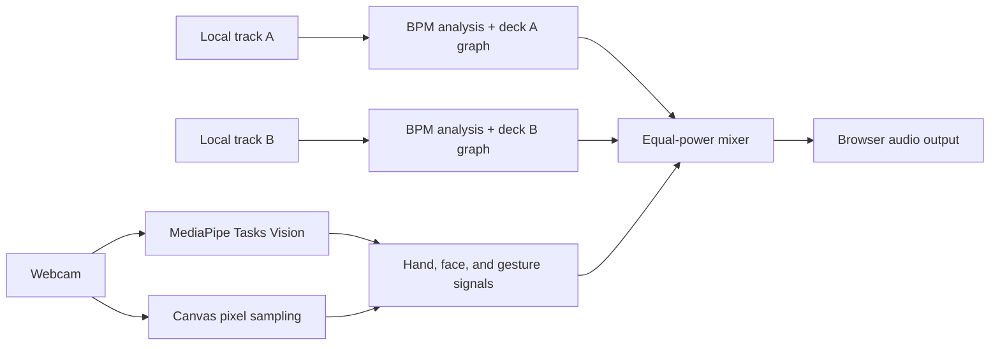

<p align="center">
  
</p>

<h1 align="center">Ultra Vision</h1>

<p align="center">
  A local-first browser instrument for real-time vision and gesture-controlled audio.
</p>

<p align="center">
  <a href="https://github.com/kaantaskentt/ultra-vision/actions/workflows/ci.yml"></a>
  <a href="./LICENSE"></a>
  
</p>


Ultra Vision turns a webcam and two audio files into a private, interactive visual instrument and DJ mixer. It tracks hands and faces, studies pixels, detects track tempo, and maps deliberate movement to focused mix controls—all inside the browser tab.

## What it can do

- **DJ Room** — mix two local tracks with independent transports, channel levels, filters, pitch-preserving tempo trim, phrase jumps, meters, and an equal-power crossfader.
- **BPM tools** — estimate BPM locally, tap a tempo when analysis needs help, and use one reversible BPM Sync control to match the idle deck to the playing deck.
- **Vision** — inspect hand landmarks, raised fingers, face signals, motion direction, and color coverage.
- **Pixel Studio** — run transparent color-similarity and luminance studies on an upload or captured frame inside Vision.
- **Gesture routing** — choose the crossfader or one deck's channel, filter, or tempo as the active hand-controlled parameter, with one-click and double-click resets.
- **Local media** — camera frames, images, and uploaded tracks are not sent to an application backend.
- **Responsive interface** — the complete workflow works from a phone-sized viewport through desktop.

## Quick start

Requirements: Node.js 20.19+ or 22.12+ and a modern Chromium, Firefox, or Safari browser.

```bash
git clone https://github.com/kaantaskentt/ultra-vision.git
cd ultra-vision
npm ci
npm run dev
```

Open the local Vite URL, choose **Start camera**, and allow camera access. Camera access requires `localhost` or HTTPS.

No API keys, database, or backend service are required.

## DJ Room workflow

1. Load a local track into each deck. Ultra Vision analyzes up to the first 90 seconds to estimate BPM.
2. If a tempo is missing or incorrect, use **Tap BPM** a few times on the beat.
3. Press the center **BPM Sync** control. The playing deck becomes the master; if neither or both are playing, Deck A leads. Press it again to restore both original tempos. Sync works within the ±20% deck range, including sensible half-time and double-time matches, and preserves pitch where the browser supports it.
4. Use the phrase pads to align the downbeat, then mix with the channel controls and equal-power crossfader.
5. Start the camera and route hand movement to the crossfader, channel level, filter, or tempo trim. Use **Reset**, **Reset mix**, or double-click a mode or slider to return it to neutral.

BPM Sync matches tempo; it does not claim automatic beat-grid or phase alignment.

## Runtime architecture



The current runtime uses:

- React 19, TypeScript, and Vite
- MediaPipe Tasks Vision for hand and face landmarks
- Canvas sampling for motion and color analysis
- Web Audio for per-deck filters, channel gain, meters, tempo control, and equal-power mixing
- Lucide for accessible interface icons

## Honest model scope

NVIDIA Eagle / LocateAnything is **not** part of the current browser runtime. It is a researched next step for open-vocabulary grounding such as “find the red mug” or “locate the object closest to my hand.”

The integration plan and model-license warning live in [docs/EAGLE_NEXT.md](./docs/EAGLE_NEXT.md). Keeping this boundary explicit prevents pixel heuristics from being presented as neural-model output.

## Quality checks

```bash
npm test
npm run lint
npm run build
npm audit
```

The CI workflow runs tests, lint, the production build, and a production-dependency audit on every push and pull request.

## Privacy and security

- Camera and uploaded media are processed in the active browser tab.
- File types and sizes are checked before object URLs are created.
- MediaPipe runtime and model origins are explicitly allow-listed by the content security policy.
- GPU initialization falls back to CPU when needed.
- The project has no secrets, accounts, analytics, or application backend.

See [SECURITY.md](./SECURITY.md) for responsible disclosure.

## Project status

Ultra Vision is an active experimental project. Vision and two-deck mixing are functional; future research includes optional open-vocabulary grounding, saved calibration profiles, waveform beat grids, richer effects, and device-level performance testing.

## Contributing

Issues and focused pull requests are welcome. Read [CONTRIBUTING.md](./CONTRIBUTING.md) before opening a change.

## License

The application code is available under the [MIT License](./LICENSE). Third-party models and libraries retain their own licenses. In particular, review the LocateAnything model license before any future integration or commercial use.
