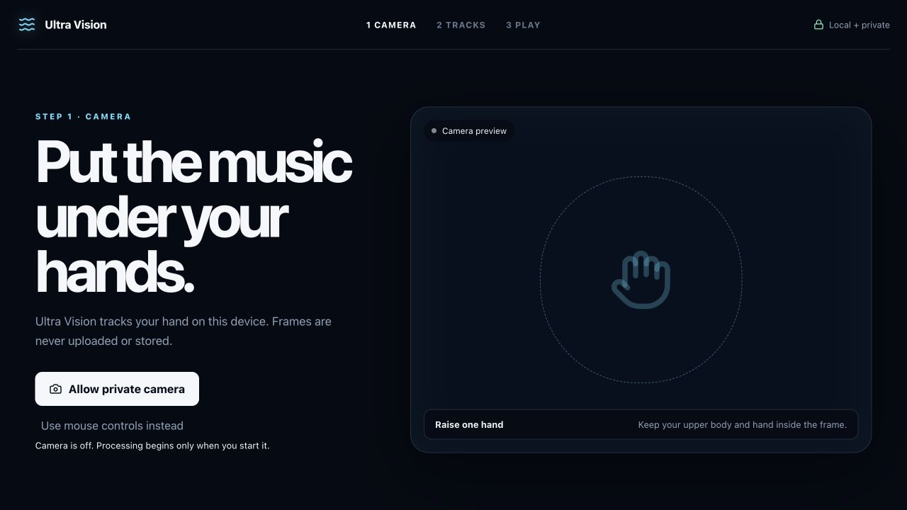
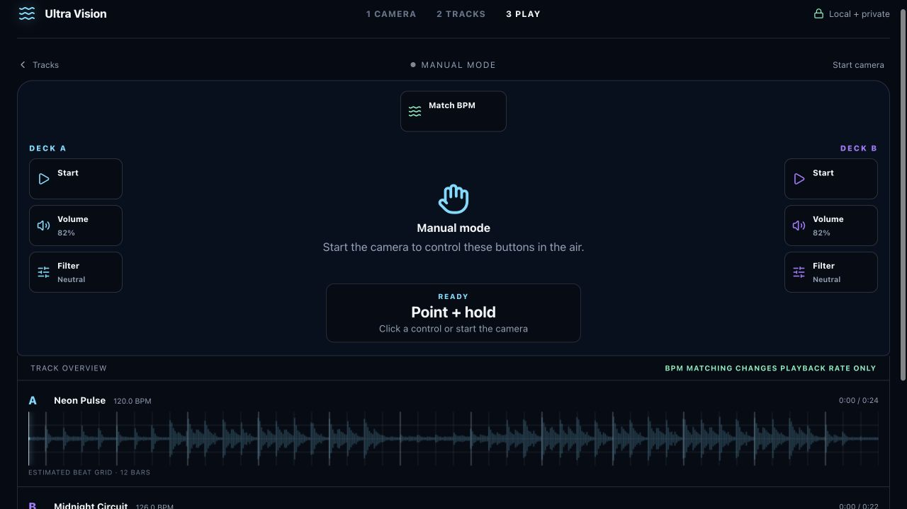
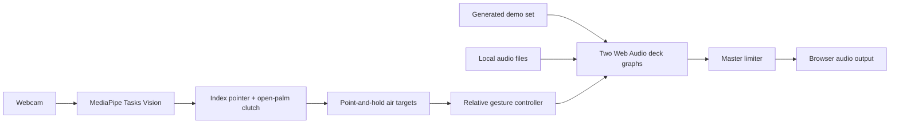

<p align="center">
  
</p>

<h1 align="center">Ultra Vision</h1>

<p align="center">
  <strong>Turn your webcam into a private DJ controller.</strong><br />
  Mix two tracks with your hand while camera frames and music stay in the browser.
</p>

<p align="center">
  <a href="https://github.com/kaantaskentt/ultra-vision/actions/workflows/ci.yml"></a>
  <a href="./LICENSE"></a>
  
</p>

<p align="center">
  <a href="https://ultra-vision.vercel.app"><strong>Try Ultra Vision live</strong></a>
  ·
  <a href="#run-it-locally">Run locally</a>
  ·
  <a href="./CONTRIBUTING.md">Contribute</a>
</p>

<p align="center">
  <a href="https://ultra-vision.vercel.app">
    
  </a>
</p>

No account, API key, database, backend, or personal audio is required for the first mix. Ultra Vision combines a generated demo set, a local Web Audio mixer, decoded track waveforms, and deliberate hand control in one browser tab.

## Try your first mix in 60 seconds

1. Open the [live app](https://ultra-vision.vercel.app) and allow the private camera—or continue with mouse controls.
2. Upload one track, add an optional second track, or choose **Try generated demo tracks**.
3. Enter the performance view. Point at a large on-camera target and hold briefly to select Play, Volume, Filter, or BPM Match.
4. Open your palm to grab the selected sound control, then move vertically for volume or rotate your wrist for filter.

A new hand never jumps the current audio value. Closing your hand locks volume; releasing Filter returns it smoothly to its neutral 50% midpoint. Every air target is also a real keyboard- and pointer-accessible button, and manual sliders stay one disclosure away.

## What it can do

- **Camera-first performance** — the camera is the instrument, with large Deck A and Deck B targets placed directly in the live scene.
- **One- or two-track entry** — start with one local track; add Deck B only when you want to mix or BPM-match.
- **Focused air controls** — only Play, Volume, Filter, and reversible BPM Match are exposed during performance.
- **Safe gesture pickup** — relative pickup prevents first-frame jumps, brief landmark flicker stays latched, and a deliberate fist releases the control.
- **Decoded track overviews** — uploaded audio becomes a real full-track peak waveform with an evidence-scored BPM estimate and clearly labeled estimated beat/bar grid.
- **Generated demo set** — build two original rhythmic loops locally and reach a playable mix without supplying audio.
- **Local media** — camera frames and uploaded tracks are not sent to an application backend.

BPM Sync matches tempo; it does not claim automatic beat-grid, downbeat, or phase alignment.

## One instrument, three clear steps

| Camera first | Live performance |
| --- | --- |
|  |  |
| Start the local hand tracker or continue with accessible mouse controls. | Point and hold to select; open your palm to shape volume or filter above decoded waveforms. |

The interface reflows from desktop down to phone-sized viewports. Real camera and audio behavior still depends on the browser and device; the maintained test matrix lives in [docs/TESTING.md](./docs/TESTING.md).

## Run it locally

Use Node.js 20.19+ or 22.12+ and a recent desktop Chromium, Firefox, or Safari browser.

```bash
git clone https://github.com/kaantaskentt/ultra-vision.git
cd ultra-vision
npm ci
npm run dev
```

Open the local Vite URL. Camera access requires `localhost` or HTTPS.

## How gesture mixing feels

1. Point your index finger at a Deck A or Deck B target and hold for 700 ms.
2. Choose Play, Volume, or Filter. BPM Match appears once both decks have BPM evidence.
3. Open your palm to grab the current value without a jump. Move vertically for level or rotate your wrist for filter.
4. Close your fist to lock volume. Filter returns to its 50% neutral point after release.

Open **Manual controls** for sliders and explicit resets whenever you want a conventional fallback.

## Runtime architecture



The current runtime uses React 19, TypeScript, Vite, MediaPipe Tasks Vision, Canvas sampling, Web Audio, and Lucide icons. Read the deeper [architecture guide](./docs/ARCHITECTURE.md).

## Honest model and product scope

MediaPipe is the shipped vision runtime. NVIDIA Eagle / LocateAnything is **not** part of the current browser application; it remains a researched option for future open-vocabulary grounding. Its integration and model-license risks are documented in [docs/EAGLE_NEXT.md](./docs/EAGLE_NEXT.md).

A bounded, post-master local recording engine also exists in the codebase, but Replay Studio does not yet have a shipped interface. The roadmap does not present foundations as finished product features.

## Quality and privacy

Run the same complete local gate expected before a pull request:

```bash
npm run check
```

That command runs the test suite with coverage floors, lint, a production build with an enforced initial-JavaScript budget, and a full dependency audit at the high-severity threshold. MediaPipe is loaded only when camera tracking is requested, so a camera-off first mix does not pay its parsing cost. CI and CodeQL run on every pull request.

Camera-runtime changes also have a hardware-free production-browser contract:

```bash
npx playwright install chromium
npm run test:browser
```

It starts one production build and runs Chromium contracts for the real MediaStream and MediaPipe lifecycle, a generated open-palm pickup, one-track entry, mobile reflow, keyboard focus, and WCAG A/AA checks across camera setup, track loading, live performance, and 390px states. It does not record a contributor or claim broad physical-camera accuracy.

- Camera and uploaded media are processed in the active browser tab.
- File types and sizes are checked before object URLs are created.
- Lock-pinned MediaPipe WASM is served from Ultra Vision's own origin. Hand and face model bundles are fetched from their exact Google-hosted upstream URLs, accepted only after byte-length and SHA-256 verification, and then passed to MediaPipe as in-memory bytes. Camera frames are never sent with those requests.
- GPU initialization falls back to CPU when needed.
- There are no accounts, application secrets, analytics, databases, or application APIs.

See [SECURITY.md](./SECURITY.md) for responsible disclosure and [THIRD_PARTY_NOTICES.md](./THIRD_PARTY_NOTICES.md) for dependency and model notices.

## Built in public with Codex

Ultra Vision was strengthened through a human-directed Codex workflow: product feedback became explicit invariants, implementation was separated from independent review, and camera/audio behavior was backed by deterministic tests before public claims changed.

Read [Building Ultra Vision with Codex](./docs/BUILDING_WITH_CODEX.md) for the decisions, failed assumptions, agent workflow, commit evidence, and remaining limitations.

## Project status

Ultra Vision is an active experimental project. Camera-first mixing, one- or two-track playback, decoded waveforms, safe gesture pickup, and the real-browser camera lifecycle are functional and automated. True downbeat/phase sync, a broader measured moving-gesture fixture corpus, and measured long-session performance remain future work.

Read the [roadmap](./ROADMAP.md), [testing strategy](./docs/TESTING.md), and [contributor guide](./CONTRIBUTING.md). Focused issues and pull requests are welcome.

## License

The application code is available under the [MIT License](./LICENSE). Third-party models and libraries retain their own licenses. Review the LocateAnything model license before any future integration or commercial use.
