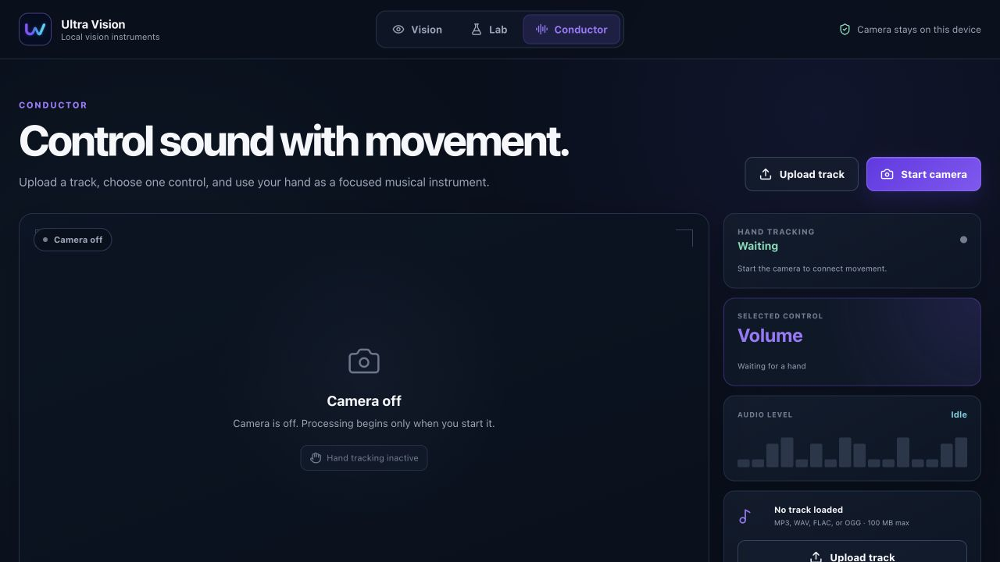
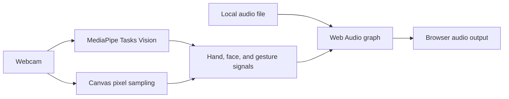

<p align="center">
  
</p>

<h1 align="center">Ultra Vision</h1>

<p align="center">
  A local-first browser instrument for real-time vision and gesture-controlled audio.
</p>

<p align="center">
  <a href="https://github.com/kaantaskentt/ultra-vision/actions/workflows/ci.yml"></a>
  <a href="./LICENSE"></a>
  
</p>



Ultra Vision turns a webcam and an audio file into a private, interactive instrument. It tracks hands and faces in real time, samples motion and color, and maps deliberate hand movement to focused audio controls—all inside the browser tab.

## What it can do

- **Conductor** — control volume, filter, atmosphere, and eight real cue positions with one selected gesture at a time.
- **Vision** — inspect hand landmarks, raised fingers, face signals, motion direction, and color coverage.
- **Lab** — run transparent color-mask and luminance studies on an upload or captured frame.
- **Local media** — camera frames and uploaded tracks are not sent to an application backend.
- **Responsive interface** — the complete workflow works from a phone-sized viewport through desktop.

## Quick start

Requirements: Node.js 20.19+ or 22.12+ and a modern Chromium, Firefox, or Safari browser.

```bash
git clone https://github.com/kaantaskentt/ultra-vision.git
cd ultra-vision
npm ci
npm run dev
```

Open the local Vite URL, choose **Start camera**, and allow camera access. Camera access requires `localhost` or HTTPS.

No API keys, database, or backend service are required.

## Conductor controls

| Control | Hand movement | Result |
| --- | --- | --- |
| Volume | Move vertically | Changes the master gain |
| Filter | Rotate your wrist | Sweeps a low-pass filter |
| Atmosphere | Move vertically | Blends a feedback delay |
| Cue | Swipe left or right | Seeks to one of eight positions |

Only the selected control responds, which prevents one movement from changing the entire mix.

## Runtime architecture



The current runtime uses:

- React 19, TypeScript, and Vite
- MediaPipe Tasks Vision for hand and face landmarks
- Canvas sampling for motion and color analysis
- Web Audio for gain, filter, delay, analysis, and seeking
- Lucide for accessible interface icons

## Honest model scope

NVIDIA Eagle / LocateAnything is **not** part of the current browser runtime. It is a researched next step for open-vocabulary grounding such as “find the red mug” or “locate the object closest to my hand.”

The integration plan and model-license warning live in [docs/EAGLE_NEXT.md](./docs/EAGLE_NEXT.md). Keeping this boundary explicit prevents pixel heuristics from being presented as neural-model output.

## Quality checks

```bash
npm test
npm run lint
npm run build
npm audit
```

The CI workflow runs tests, lint, the production build, and a production-dependency audit on every push and pull request.

## Privacy and security

- Camera and uploaded media are processed in the active browser tab.
- File types and sizes are checked before object URLs are created.
- MediaPipe runtime and model origins are explicitly allow-listed by the content security policy.
- GPU initialization falls back to CPU when needed.
- The project has no secrets, accounts, analytics, or application backend.

See [SECURITY.md](./SECURITY.md) for responsible disclosure.

## Project status

Ultra Vision is an active experimental project. The browser experience is functional; future research includes optional open-vocabulary grounding, calibration profiles, richer audio effects, and device-level performance testing.

## Contributing

Issues and focused pull requests are welcome. Read [CONTRIBUTING.md](./CONTRIBUTING.md) before opening a change.

## License

The application code is available under the [MIT License](./LICENSE). Third-party models and libraries retain their own licenses. In particular, review the LocateAnything model license before any future integration or commercial use.
