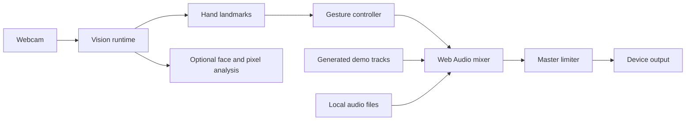

# Architecture

Ultra Vision is a client-only React application. It has no accounts, database, application API, or analytics backend.

## Runtime flow



## Vision runtime

`useVisionRuntime` owns cancellable startup, camera permission, the MediaPipe fileset, hand/face models, frame scheduling, canvas drawing, and recovery. It loads the pinned runtime and startup-required models before opening the camera. DJ Room enables hand tracking only. Vision enables face and pixel analysis lazily; switching an already-running DJ camera into Vision can therefore load the optional face model afterward.

The runtime emits a small `GestureFrame` rather than exposing MediaPipe objects to the mixer. Primary-hand continuity favors the previous handedness and nearest position to reduce ordering jumps.

## DJ mixer

`useDjMixer` owns two hidden media elements and their Web Audio graph:

```text
media source → high-pass → low-pass → channel gain → crossfade gain → analyser → master limiter → output
```

React state mirrors user-facing deck status. Refs own high-frequency or imperative audio state. Gesture takeover calibrates relative to the current value so the first hand frame cannot jump a control.

## Trust boundaries

- Camera and media remain in the tab.
- MediaPipe WASM and model files are fetched from explicitly allow-listed Google and jsDelivr origins before camera permission is requested. This is a documented third-party runtime trust boundary; self-hosting those assets is planned before a privacy-focused 1.0 release.
- Object URLs are revoked when tracks are replaced or the mixer unmounts.
- Future hosted models or persistence require a new threat model and informed-consent design.
