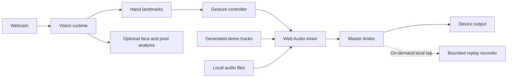

# Architecture

Ultra Vision is a client-only React application. It has no accounts, database, application API, or analytics backend.

## Runtime flow



## Vision runtime

`useVisionRuntime` owns cancellable startup, camera permission, the MediaPipe fileset, hand/face models, frame scheduling, canvas drawing, and recovery. It loads the pinned runtime and startup-required models before opening the camera. DJ Room enables hand tracking only. Vision enables face and pixel analysis lazily; switching an already-running DJ camera into Vision can therefore load the optional face model afterward.

The runtime emits a small `GestureFrame` rather than exposing MediaPipe objects to the mixer. Primary-hand continuity favors the previous handedness and nearest position to reduce ordering jumps.

## DJ mixer

`useDjMixer` owns two hidden media elements and their Web Audio graph:

```text
media source → high-pass → low-pass → channel gain → crossfade gain → analyser → master limiter → output
```

React state mirrors user-facing deck status. Refs own high-frequency or imperative audio state. Gesture takeover calibrates relative to the current value so the first hand frame cannot jump a control.

## Air Mix Replay foundation

`createMasterCapture` creates an isolated, releasable `MediaStreamAudioDestinationNode` after the master dynamics stage. Releasing that tap disconnects only the recorder branch, so it cannot mute the speaker path or stop either deck.

`airMixReplay` owns the local recorder state machine, codec negotiation, duration and memory ceilings, final-chunk ordering, object URL cleanup, and stale-session protection. It accepts a dedicated canvas plus the post-master audio handle; it does not request the camera, microphone, network, or screen. The recording engine is intentionally not connected to a visible product control until a Replay Studio visual direction is selected and browser-verified.

## Trust boundaries

- Camera and media remain in the tab.
- Lock-pinned MediaPipe WASM is served from the application origin. Hand and face model bundles remain external because their object URLs do not publish clear model-specific redistribution terms; Ultra Vision accepts them only after HTTP success, exact byte length, and SHA-256 verification, then passes the verified bytes through `modelAssetBuffer` before requesting camera permission.
- The model host is permitted only by `connect-src`, never `script-src`, and model requests contain no camera frames.
- Object URLs are revoked when tracks are replaced or the mixer unmounts.
- Future hosted models or persistence require a new threat model and informed-consent design.
