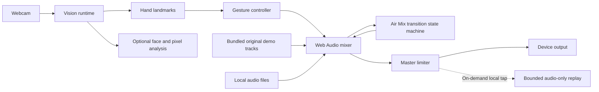

# Architecture

Ultra Vision is a client-only React application. It has no accounts, database, application API, or analytics backend.

## Runtime flow



## Vision runtime

`useVisionRuntime` owns cancellable startup, camera permission, the MediaPipe fileset, hand/face models, frame scheduling, canvas drawing, and recovery. It loads the pinned runtime and startup-required models before opening the camera. DJ Room enables hand tracking only. Vision enables face and pixel analysis lazily; switching an already-running DJ camera into Vision can therefore load the optional face model afterward.

The runtime emits a small `GestureFrame` rather than exposing MediaPipe objects to the mixer. Primary-hand continuity favors the previous handedness and nearest position to reduce ordering jumps.

## DJ mixer

`useDjMixer` owns two hidden media elements and their Web Audio graph:

```text
media source → high-pass → low-pass → channel gain → crossfade gain → analyser → master limiter → output
```

React state mirrors user-facing deck status. Refs own high-frequency or imperative audio state. Gesture takeover grabs relative to the current value so the first hand frame cannot jump a control; a small clutch state machine absorbs landmark flicker and confirms release intent.

Full-track waveform and beat-grid analysis is additive: it feeds the visual beat workspace without replacing the original BPM queue, gesture clutch, filter release, or deck-control behavior. Beat and bar markers are estimates rather than phase or downbeat claims.

## Air Mix and local replay

`airMixTransition` plans one source-to-target transition without pretending every uploaded file has a trustworthy beat grid. When both sources are the bundled demos, their authored BPM and bar-offset metadata schedule Demo Air Mix on the next authored bar. Local or mixed-source decks use an immediate 4.8-second Assisted Fade. Assisted Fade applies a bounded estimated tempo match only when both local beat analyses clear the confidence threshold; it does not claim downbeat, phase, or phrase alignment.

`useDjMixer` owns the transition lifetime. It starts the target deck, applies an equal-power crossfade, pauses the source after completion, and restores the source side and target tempo if the transition is cancelled or cannot start. Transport, seeking, track replacement, reset, or a new sync action cancels the active transition so stale scheduled work cannot override newer user intent.

`createMasterCapture` creates an isolated, releasable `MediaStreamAudioDestinationNode` after the master dynamics stage. Releasing that tap disconnects only the recorder branch, so it cannot mute the speaker path or stop either deck.

`localReplay` owns the shipped audio-only recorder state machine, codec negotiation, duration and memory ceilings, final-chunk ordering, object URL cleanup, and stale-session protection. `useLocalReplay` connects it to the post-master capture handle and the DJ Room's Record control. A finished artifact can be previewed, downloaded, or discarded in the same tab. The recorder requests no camera, microphone, network, or screen capture; the separate canvas-plus-audio engine remains an unshipped foundation for possible future video export.

## Trust boundaries

- Camera and media remain in the tab.
- Audio replay remains in bounded browser memory while it is previewed, until it is discarded or the tab closes. Download saves a local copy; there is no upload or application-persistence path.
- Lock-pinned MediaPipe WASM is served from the application origin. Hand and face model bundles remain external because their object URLs do not publish clear model-specific redistribution terms; Ultra Vision accepts them only after HTTP success, exact byte length, and SHA-256 verification, then passes the verified bytes through `modelAssetBuffer` before requesting camera permission.
- The model host is permitted only by `connect-src`, never `script-src`, and model requests contain no camera frames.
- Object URLs are revoked when tracks are replaced or the mixer unmounts.
- Future hosted models or persistence require a new threat model and informed-consent design.
