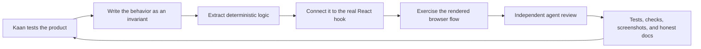

# Building Ultra Vision with Codex

Ultra Vision is being built through a human-directed Codex workflow: Kaan sets the product taste and acceptance criteria, while Codex inspects the actual implementation, proposes a bounded change, writes tests, exercises the browser flow, and asks independent agents to challenge the result.

This is an engineering journal, not a claim that an agent independently invented or validated the product. It records the decisions and evidence behind the open-source hardening cycle captured in [pull request #5](https://github.com/kaantaskentt/ultra-vision/pull/5).

## The product brief changed through use

The project began as a browser vision experiment with music controls. Testing it as a performer exposed a clearer product: two focused workspaces, with the camera as an intentional DJ input rather than a novelty overlay.

Kaan made the taste decisions:

- Rename the performance surface **DJ Room** and keep only two top-level tabs: Vision and DJ Room.
- Keep the live camera stage above the decks and master mixer.
- Replace ambiguous sliders with controls that feel closer to DJ hardware.
- Make every mode and mix parameter easy to reset.
- Use one reversible BPM Sync control instead of exposing confusing tempo controls.
- Treat a DJ filter as bipolar: low-pass on one side, neutral at 50%, and high-pass on the other.
- Do not let the first detected hand move audio, and do not leave Filter stuck after the performer releases it.
- Let anyone hear the idea immediately without finding two music files.
- Keep camera frames and music in the browser.

Codex translated those decisions into explicit invariants in [AGENTS.md](../AGENTS.md), then implemented and tested against those invariants.

## The loop we used

The important part is the order. A passing unit test is not enough for a camera or audio lifecycle, and a good-looking screenshot is not enough for a privacy or control claim.

## What changed, with evidence

| Round | Product or engineering problem | Result | Evidence |
| --- | --- | --- | --- |
| DJ Room rebuild | The original music interaction was spread across ambiguous controls and screens. | Two decks, one master mixer, one BPM Sync control, and a camera stage were brought into one performance surface. | Commits `4f0b7b8`, `ff53e56`, and `29547d7`; current DJ Room screenshots in `docs/design/` |
| First-run experience | A new visitor needed private audio files before hearing the idea. | **Try demo set** now synthesizes two short loops locally. | `src/lib/demoAudio.ts` and deterministic WAV-generation tests |
| Gesture takeover | A detected hand could immediately drag an existing control away from its current value, while wrist rotation could momentarily hide fingers and drop the gesture. | An open-palm clutch grabs the current value, holds through short landmark flicker, and releases only after a deliberate fist or sustained loss. | `src/lib/gestureController.ts`, unit traces, and the real hook integration suite |
| Filter release | Filter could inherit a stale wrist baseline or remain offset after the hand closed or disappeared. | Release invalidates the baseline and eases Filter back to its 50% neutral point. | Timed state-machine tests and Web Audio parameter assertions |
| Camera remounting | Moving between Vision and DJ Room could detach the active overlay or let stale asynchronous playback tear down a valid stream. | Canvas attachment and video playback use ownership-aware lifecycle helpers. | `cameraOverlayLifecycle` and `videoElementLifecycle` tests plus a real camera tab-switch check |
| Replay foundation | A future shareable clip needed the sound after the master dynamics stage without adding microphone, screen, or upload permissions. | A bounded local recorder can tap post-master audio and merge it with an owned canvas stream. No visible Replay Studio interface is claimed yet. | `src/lib/airMixReplay.ts`, mixer integration tests, strict duration and memory limits |
| Repository trust | Documentation and CI could drift from the commands contributors actually ran. | One Vitest configuration owns coverage floors, clean npm 10 installation is reproducible, and the repository records privacy and model boundaries. | CI, CodeQL, `docs/TESTING.md`, `SECURITY.md`, and `THIRD_PARTY_NOTICES.md` |
| Launch readiness | A static checklist could say the performer was ready when the camera or gesture was not, and a real room frame had slipped into repository evidence. | Readiness now advances only from actual track, camera, hand, and clutch state; public screenshots are camera-off and stale retired controls were removed. | `src/lib/firstMixReadiness.ts`, app integration tests, and current privacy-safe screenshots in `docs/design/` |

At commit `20b9971`, the branch had 77 passing deterministic and React integration tests. Coverage was 62.08% statements, 48% branches, 51.56% functions, and 63.33% lines; CI, CodeQL, lint, build, and the high-severity dependency audit were green. Those numbers are a historical snapshot, not a substitute for running the current `npm run check` command.

The current launch candidate has 128 passing tests with 81.43% statement, 73.82% branch, 81.76% function, and 83.29% line coverage. The same gate also passes lint, the production build, and the full dependency audit with zero known vulnerabilities.

## Assumptions that failed

The most useful Codex work came from finding where an apparently reasonable implementation was still wrong:

- **Absolute gesture mapping looked simple, but it caused jumps.** The control needed relative pickup against its current state plus release hysteresis for imperfect landmark frames.
- **A hand being visible was not the same as intent.** The open-hand clutch became a product requirement rather than a confidence threshold.
- **Resetting React state did not guarantee audio reset.** Tests had to inspect the Web Audio parameters as well as the interface value.
- **Keeping a camera stream alive did not guarantee the visible canvas stayed attached.** Tab switching required separate stream ownership and overlay attachment lifecycles.
- **A successful local install did not prove a clean install.** The lockfile was checked again with the npm version used by CI.
- **A green coverage command was not trustworthy while two Vitest configurations disagreed.** The project moved back to one authoritative configuration and published its actual floors.

Publishing these failures matters more than publishing a perfect-looking prompt transcript. They are the reusable engineering lessons.

## How agents were used

Implementation stayed with one owner at a time. Read-only subagents were given narrow review jobs such as:

- challenge the gesture state machine for stale frames and reacquisition jumps;
- inspect camera and Web Audio resource ownership;
- threat-model local recording and permission boundaries;
- look for tests that passed without proving the public claim;
- compare documentation against the current code and deployment state.

The main agent then reproduced important findings before changing code. Agent consensus was never treated as runtime evidence.

## Privacy influenced the architecture

“Local-first” does not mean “nothing is fetched.” The application has no account system or application backend, and camera frames and uploaded tracks stay in the tab. Lock-pinned MediaPipe WASM is now served from the application origin. Hand and face model bundles remain exact upstream fetches because their object URLs do not state clear redistribution terms; Ultra Vision verifies their byte lengths and SHA-256 digests before giving their in-memory bytes to MediaPipe. No camera frame is part of those requests.

The replay foundation follows the same rule. It uses an app-owned canvas and the post-master mixer output; it does not request the microphone, capture the screen, upload media, or persist a recording. Recording duration and in-memory size are bounded. The interface will not be presented as shipped until its visual direction and real-browser playback are verified.

NVIDIA Eagle / LocateAnything is similarly documented as research rather than mislabeled as part of the current runtime.

## Reuse this workflow in Codex

1. Put stable product and safety rules in `AGENTS.md`.
2. Ask the human for an observable experience, not only a feature name.
3. Turn that experience into deterministic invariants and failure cases.
4. Keep gesture, audio, and vision math pure where possible.
5. Mount the real hooks in integration tests so refs, cleanup, and browser lifecycles are exercised.
6. Use the browser and a real device for the behavior that fakes cannot prove.
7. Give independent agents small adversarial reviews, then reproduce their findings.
8. Run `npm run check` and update public claims only after the evidence changes.

The repository's current agent contract lives in [AGENTS.md](../AGENTS.md), and the device and automation layers are described in [docs/TESTING.md](./TESTING.md).

## What the next cycle must prove

- A selected Replay Studio interface produces a playable local clip in current Chrome, Safari, and Firefox.
- Golden-path browser automation covers initial load, demo-set playback, permission denial, camera remounting, and stop/restart.
- Camera frame rate, gesture latency, audible transitions, and 30-minute memory behavior are measured rather than estimated.
- Model provenance and redistribution terms are rechecked before changing the verified upstream-fetch boundary or publishing a privacy-focused 1.0 claim.
- BPM Sync remains described as playback-rate matching until beat-grid and phase alignment exist.

That gap list is intentional. The Codex workflow is valuable only when it keeps “implemented,” “connected,” “deployed,” and “browser-verified” as separate claims.
