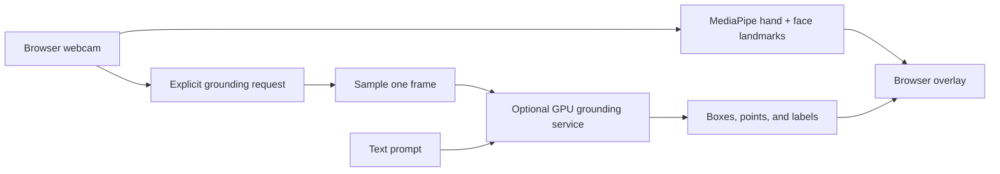

# NVIDIA Eagle / LocateAnything integration path

Conductor Vision currently uses MediaPipe in the browser for live hand and face landmarks. That is the right runtime for interactive gesture control: it returns joint geometry directly, stays on-device, and runs at webcam frame rates on ordinary laptops.

NVIDIA's LocateAnything-3B is the researched next backend for **prompted visual grounding**, not a dependency hidden inside the current application.

## Where LocateAnything adds value

The model is designed for grounding, detection, and pointing prompts such as:

- “Find the red mug.”
- “Draw a box around the keyboard.”
- “Which object is closest to my hand?”
- “Locate all buttons on this screen.”

The official NVIDIA project describes support for referring-expression grounding, multi-object detection, GUI element grounding, text localization, and point-based localization.

## Verified sources

- [NVlabs/Eagle repository](https://github.com/NVlabs/Eagle)
- [LocateAnything implementation guide](https://github.com/NVlabs/Eagle/tree/main/Embodied)
- [LocateAnything-3B model card](https://huggingface.co/nvidia/LocateAnything-3B)
- [NVIDIA research page](https://research.nvidia.com/labs/lpr/locate-anything/)
- [LocateAnything paper](https://arxiv.org/abs/2605.27365)

Sources and license terms were rechecked in July 2026.

## License boundary

The Eagle code repository is Apache-2.0, but the LocateAnything-3B model weights use a separate NVIDIA license. The model license limits the model and derivatives to non-commercial research or evaluation use.

Do not bundle the weights into Conductor Vision or present the model as commercially usable without a new license review.

## Proposed architecture



The browser should keep live MediaPipe processing as the default. A grounding request would sample a single consented frame and send it with a text prompt to an optional GPU service.

## Suggested API contract

```http
POST /api/ground
Content-Type: multipart/form-data

image=<sampled frame>
prompt=locate all fingertips
```

```json
{
  "boxes": [
    {
      "label": "index fingertip",
      "x1": 0.12,
      "y1": 0.2,
      "x2": 0.18,
      "y2": 0.29
    }
  ],
  "points": [
    {
      "label": "thumb tip",
      "x": 0.4,
      "y": 0.6
    }
  ]
}
```

Coordinates should remain normalized from `0` to `1`, with a versioned response schema and a maximum frame size enforced at the API boundary.

## Release gates

Before this backend ships:

1. Confirm an allowed product use under the model license.
2. Add explicit consent and a visible “frame leaves this device” state.
3. Define retention, deletion, and logging behavior.
4. Authenticate and rate-limit the grounding endpoint.
5. Validate file type, decoded dimensions, and prompt length server-side.
6. Add timeouts, GPU admission control, and a safe local fallback.
7. Threat-model model loading, `trust_remote_code`, prompt handling, and result rendering.
